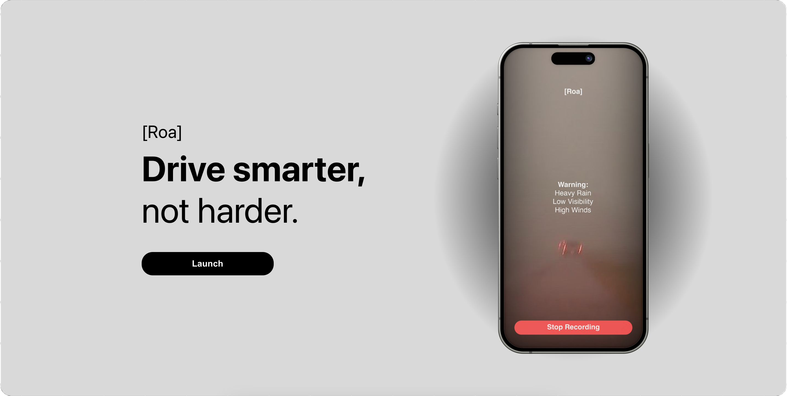

# Roa (Road Operational Assistant) | HackPSU S24
Live: https://www.roai.tech/ \
Full Documentation: [Click Here](https://docs.google.com/document/d/1GKJtoUw5x7jsu0hhcjV1IlJCumnQOxCSvxdRN2hLgcY/edit?usp=sharing)

## Mission Statement
To leverage artificial intelligence, computer vision, and innovative road threat detection to make traveling safer.

## Our Goal
To bring the safety features of self-driving car technology to everyone across the socio-economic spectrum.
## Market
The common driver and commuter.

## Features
Analyzes historical accident data and patterns, traffic density, weather, and more to alert and warn the driver of potential risks ahead of time.

## Tech Stack 
**Front-end:** Javascript (React)\
**Back-end:** Python (with OpenCV)\
**Deployment:** Vercel (Frontend)\
**APIs:** ChatGPT 3.5 Turbo (OpenAI), OpenWeather, Google Maps, Custom-Made AI (danger road detector)\
**Assets:** https://i.stack.imgur.com/MnyxU.gif (loading)

## Detecting Safety
We are using two separate algorithms that determine whether or not the road will be accident prone, warning the user if so.
One algorithm uses ML that uses images from the phone that has been trained from images that accidents have occured, and the other
uses API calls using road conditions that determines if the weather or road conditions are dangerous to drive on.

## Part 1: Image Detection
Using your phone camera, it captures an image and is analyzed using a custom-trained model that has used locations of where accidents occur and determines if the road is safe based off of that.

## Part 2: Weather Analysis
GPS would be used to get conditions of the road and returns a confidence interval from -100 to 100 
(-100 being very confident it is safe, 100 being very confident that it is dangerous) 
1. Depending on certain conditions, it can instantly flag with 100 confidence (it can be multiple conditions) to create a message for the user to be cautious due to the flags \
  -Eg; black ice warning has been given 
Calculated using the formula of |total risk - risk_0| / risk_0 \
  -total risk is determined by a decision matrix of road conditions \
  -risk_0 is the average total risk (half of max total risk) – eg; if conditions are ideal it'll be 0 - 8.5 = -100 \
If confidence is below 0, then it is saying conditions are safe \ 
If confidence is above 0, then conditions are unsafe 

2. Prioritized what conditions are most important for the user to know from a scale from 1 to 5 (1 being non-important, 5 being the most important) \
  -Alert level (the severity of the weather alert) – 5 \
    -If the alert is a level 4 (highest severity), flag the user with the weather event name \
  -Precipitation rate (how hard it’s raining in mm/h) – 4 \
  -If it’s violently raining (> 50 mm/h), flag the user that it’s violently raining \
  -Icy road (if there's a black ice warning) – flag or no flag \
  -Road temperature (kelvin) – 2 \
  -If the road temp is below freezing, return a 2 \
  -Wind speed (meters/second) – 2 \
  -Speed of the car is accounted as a multiplier \
Since bad conditions can be handled if the speed limit is low, or if less worse conditions can still be dangerous because you are traveling quickly

## Challenges
Connecting the front/back end \
Training the AI model \
 -Used a dataset that had 7.9 million images

## Potential Features
Incoroporate our app into google maps using AR \
  -We can have users be prepared to be in a certain lane (Google maps may not recommend what lane you should be in
so you are prepared ahead of time) 
Allowing different users to be supported with the algorithms (cyclists, buses, trucks, etc)

## Acknowledgements
**The team:** Scott Garcia, Jon Chen, Vinh Ngo, Matt Witmer, Caleb Kendig\
Made with ❤️ from Happy Valley
